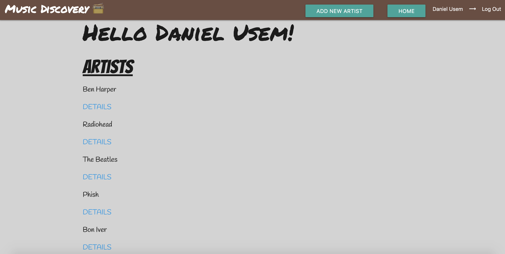
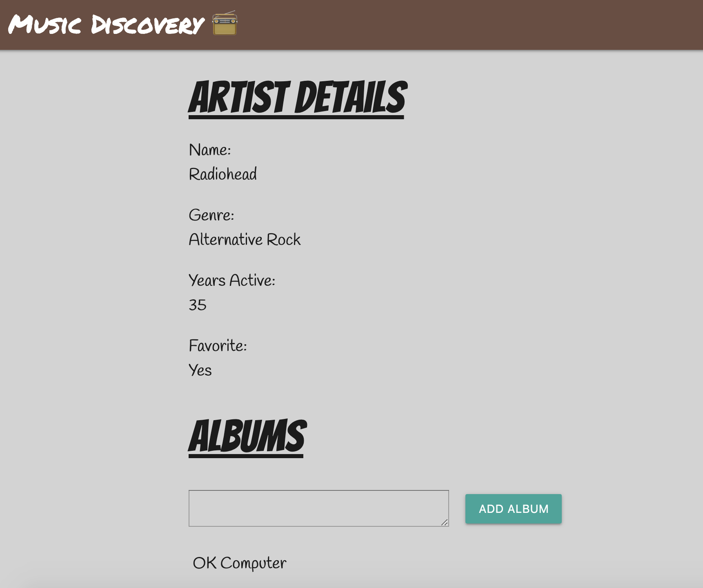
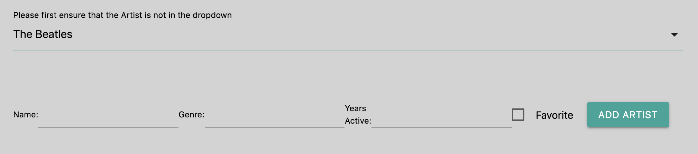

# Music-Discovery-App
Music Discovery App is a music tracking application that allows a user to keep track of the music they're listening to. It allows a user to keep track of their favorite artists as well as their albums.

## Screenshots

## Technologies Used
HTML, CSS, Javascript, MongoDB, Express, React, Node.js, OAuth Authentication

## Getting Started
https://music-discovery-application.herokuapp.com/

## Next Steps
Planned future enhancements include adding an embedded song model within the existing album model.

